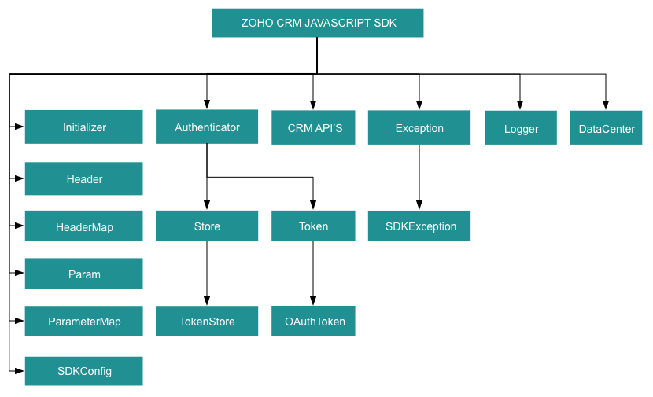

License
=======

    Copyright (c) 2021, ZOHO CORPORATION PRIVATE LIMITED 
    All rights reserved. 

    Licensed under the Apache License, Version 2.0 (the "License"); 
    you may not use this file except in compliance with the License. 
    You may obtain a copy of the License at 
    
        http://www.apache.org/licenses/LICENSE-2.0 
    
    Unless required by applicable law or agreed to in writing, software 
    distributed under the License is distributed on an "AS IS" BASIS, 
    WITHOUT WARRANTIES OR CONDITIONS OF ANY KIND, either express or implied. 
    See the License for the specific language governing permissions and 
    limitations under the License.

# ZOHO CRM JAVASCRIPT SDK 6.0 for API version 6

## Table Of Contents

* [Overview](#overview)
* [Registering a Zoho Client](#registering-a-zoho-client)
* [Environmental Setup](#environmental-setup)
* [Including the SDK in your project](#including-the-sdk-in-your-project)
  * [ZET Framework](#zet-framework)
* [Persistence](#token-persistence)
* [Configuration](#configuration)
* [Initialization](#initializing-the-application)
* [Class Hierarchy](#class-hierarchy)
* [Responses And Exceptions](#responses-and-exceptions)
* [Sample Code](#sdk-sample-code)

## Overview

The JavaScript SDK offers a way to create client JavaScript applications that can be integrated with Zoho CRM.

## Registering a Zoho Client

Since Zoho CRM APIs are authenticated with OAuth2 standards, you should register your client app with Zoho. To register your app:

- Visit this page [https://api-console.zoho.com/](https://api-console.zoho.com)

- Click `ADD CLIENT`.

- Choose the `Client Type` as **Client-based Applications**.

- Enter **Client Name**, **Homepage URL**, **Authorized Redirect URIs** and **JavaScript Domain**. Click `CREATE`.

- Your client app will be created and displayed now.

- Select the created OAuth client.

or

- [WebApps Integration](https://www.zoho.com/crm/developer/docs/webapp-sdk/web-integration.html#Create_Client)

## Environmental Setup

You can install any browser as per your preference. JavaScript works on any web browser on any OS.

## Including the SDK in your project

### CDN URL

- https://static.zohocdn.com/zohocrm/v6.0/sdk/2.0.0/zohocrmsdk-6-0.js

JavaScript SDK can be incorporated in two ways:

* [Integrating JS SDK via Webapps](https://www.zoho.com/crm/developer/docs/webapp-sdk/).

* [Using JS SDK on your own application](#using-js-sdk-on-your-own-application).

### Integrating JS SDK via Webapps

#### Follow the given steps for Integrating JS SDK

- Register the client from CRM UI and note the client ID.
- Create a new project using the command `zet init` via terminal/command line. Choose the option `Catalyst` and give the project name.
- A new folder will be created with the project name. This folder will contain the file **plugin_manifest.json**. Update the client ID in that file and add required scopes to be used in the web app.
- Under the project folder, there will be another folder named **app**. This will act as the base.
- Include the **zohocrmsdk-6-0.js** file (available in app folder) and use it in your HTML files.

#### a. For Webapps Integration

- After the development, run the command `zet pack` from the project base folder and upload it in CRM UI. **FYI** : Only one app can be uploaded for each client. While updating with new app, old one has to be deleted. Also, redirect url will be changed.
- To know the redirect url, **Initializer.store.getToken(token)** function has to be accessed from web app. It will redirect to **http://accounts.zoho.com/oauth/v2/auth** along with a parameter **redirect_uri**. Configure this in **https://api-console.zoho.com**. Eg : if the redirect_uri is "https://99000000223015.zappscontents.com/appfiles/99000000223015/1.0/1dd62561c00429f2c4970bf4f2b4dc09142d08b6949a17a5c3388f30851ec9cf/redirect.html", then the **Authorized redirect URIs** is "https://99000000223015.zappscontents.com/appfiles/99000000223015/1.0/1dd62561c00429f2c4970bf4f2b4dc09142d08b6949a17a5c3388f30851ec9cf/redirect.html"
- The **JavaScript Domain** is "https://99000000223015.zappscontents.com"

#### b. To test it in local machine using web framework

- Create a redirect.html page within the app folder.
- Run it using the `zet run` via terminal/command line.
- Enter **127.0.0.1:{your_port_number}** for eg. 127.0.0.1:5000 in the browser address bar and select the app_file.html
- It'll redirect to accounts.zoho.com/oauth/v2/auth along with the parameter redirect_uri. Configure this in https://api-console.zoho.com/.
- If the page successfully redirects to the **redirect.html** page then the app works as intended.
- Once token is set for the first time, the page will be reloaded.

### Using JS SDK on your own application

- Create a redirect.html page for your application.
- Set up your own web server and authorize the SDK.
- You can then use the SDK.

## Token Persistence

## Configuration

Before you get started with creating your JavaScript application, you need to register your client and authenticate the app with Zoho.

- Create an instance of **Logger** Class to log exception and API information.

    ```js
    /*
    * Create an instance of Logger Class that takes parameter
    * 1 -> Level of the log messages to be logged. Can be configured by typing Levels "." and choose any level from the list displayed.
    */
    let logger = Logger.getInstance(Levels.ALL);
    ```

- Configure the API environment which decides the domain and the URL to make API calls.

    ```js
    /*
    * Configure the environment
    * which is of the pattern Domain.Environment
    * Available Domains: US, EU, IN, CN, AU, CA
    * Available Environments: PRODUCTION(), DEVELOPER(), SANDBOX()
    */
    let environment = DataCenter.US.PRODUCTION();
    ```

- Create an instance of **OAuthToken** with the information that you get after registering your Zoho client.

    ```js
    /*
    * Create a Token instance
    * clientId -> OAuth client id.
    * scope -> OAuth client scope.
    * redirectURL -> OAuth Redirect URL.
    */
    let token = new OAuthBuilder()
      .clientId("clientId")
      .scope("scope")
      .redirectURL("redirectURL")
      .build();
    ```

- Create an instance of **SDKConfig** containing the SDK configuration.

    ```js
    /*
      * autoRefreshFields
      * if true - all the modules' fields will be auto-refreshed in the background, every hour.
      * if false - the fields will not be auto-refreshed in the background. The user can manually delete the cache or refresh the fields using methods from ModuleFieldsHandler
      *
      * cacheStore
      * A boolean field that allows or disallows the storage of module field information in cache.
      * True - the SDK stores all the modules' field information in cache, and refreshes every hour, if autoRefreshFields is true.
      * False - the SDK temporarily stores the modules' field information in a Map.
      *
      * pickListValidation
      * A boolean field that validates user input for a pick list field and allows or disallows the addition of a new value to the list.
      * True - the SDK validates the input. If the value does not exist in the pick list, the SDK throws an error.
      * False - the SDK does not validate the input and makes the API request with the user’s input to the pick list
      *
      * timeout
      * representing the number of milliseconds a request can take before automatically being terminated.
    */
    let sdkConfig = new SDKConfigBuilder()
    .autoRefreshFields(true)
    .pickListValidation(false)
    .cacheStore(true)
    .timeout(1000)
    .build();
    ```

## Initializing the Application

Initialize the SDK using the following code.

```js
class SDKInitializer {
    static async initializeSDK() {
        /*
         * Create an instance of Logger Class that takes parameter
         * 1 -> Level of the log messages to be logged. Can be configured by typing Levels "." and choose any level from the list displayed.
        */
        let logger = Logger.getInstance(Levels.ALL);

        /*
         * Configure the environment
         * which is of the pattern Domain.Environment
         * Available Domains: US, EU, IN, CN, AU, CA
         * Available Environments: PRODUCTION(), DEVELOPER(), SANDBOX()
        */
        let environment = DataCenter.US.PRODUCTION();

        /*
         * Create a Token instance
         * clientId -> OAuth client id.
         * scope -> OAuth client scope.
         * redirectURL -> OAuth Redirect URL.
         */
        let token = new OAuthBuilder()
          .clientId("clientId")
          .scope("scope")
          .redirectURL("redirectURL")
          .build();

        /*
          * autoRefreshFields
          * if true - all the modules' fields will be auto-refreshed in the background, every hour.
          * if false - the fields will not be auto-refreshed in the background. The user can manually delete the cache or refresh the fields using methods from ModuleFieldsHandler
          *
          * cacheStore
          * A boolean field that allows or disallows the storage of module field information in cache.
          * True - the SDK stores all the modules' field information in cache, and refreshes every hour, if autoRefreshFields is true.
          * False - the SDK temporarily stores the modules' field information in a Map.
          *
          * pickListValidation
          * A boolean field that validates user input for a pick list field and allows or disallows the addition of a new value to the list.
          * True - the SDK validates the input. If the value does not exist in the pick list, the SDK throws an error.
          * False - the SDK does not validate the input and makes the API request with the user’s input to the pick list
          *
          * timeout
          * representing the number of milliseconds a request can take before automatically being terminated.
        */
        let sdkConfig = new SDKConfigBuilder()
        .autoRefreshFields(true)
        .pickListValidation(false)
        .cacheStore(true)
        .build();

        /*
         * Call the static initialize method of Initializer class that takes the following arguments
         * environment -> Environment instance
         * SDKConfig -> SDKConfig instance
         * token -> Token instance
         * logger -> Logger instance
         */
        (await new InitializeBuilder())
            .environment(environment)
            .token(token)
            .SDKConfig(sdkConfig)
            .logger(logger)
            .initialize();
    }
}
```

- You can now access the functionalities of the SDK. Refer to the sample codes to make various API calls through the SDK.

## Class Hierarchy



## Responses and Exceptions

All SDK method calls return an instance of **[APIResponse](src/com/zoho/crm/api/util/api_response.js)**.

After a successful API request, the **getObject()** method returns an instance of the ResponseWrapper (for **GET**) or the ActionWrapper (for **POST, PUT, DELETE**).

Whenever the API returns an error response, the **getObject()** returns an instance of **APIException** class.

**ResponseWrapper** (for **GET** requests) and ActionWrapper (for **POST, PUT, DELETE** requests) are the expected objects for Zoho CRM APIs’ responses

However, some specific operations have different expected objects, such as the following

- Operations involving records in Tags

  - **RecordActionWrapper**

- Getting Record Count for a specific Tag operation

  - **CountWrapper**

- Operations involving BaseCurrency

  - **BaseCurrencyActionWrapper**

- Lead convert operation

  - **ConvertActionWrapper**

- Retrieving Deleted records operation

  - **DeletedRecordsWrapper**

- Record image download operation

  - **FileBodyWrapper**

- MassUpdate record operations

  - **MassUpdateActionWrapper**
  - **MassUpdateResponseWrapper**

- For Transfer Pipeline operation
  - **APIResponse&lt;TransferPipelineActionHandler&gt;**

All other exceptions such as SDK anomalies and other unexpected behaviours are thrown under the **[SDKException](src/com/zoho/crm/api/exception/sdk_exception.js)** class.

### GET Requests

- The **getObject()** of the returned APIResponse instance returns the response as follows.

- Most of the APIs follows the **Common** Structure as below.

  - The **ResponseHandler class** encompasses the following
    - **ResponseWrapper class** (for **application/json** responses)
    - **FileBodyWrapper class** (for File download responses)
    - **APIException class**

- Some of the APIs follow the **Particular** Structure as below.

  - The **ResponseHandler interface** encompasses the following
    - **HistoryWrapper class** (for **application/json** responses in **backup** API, holds the list of instances of **History class** and instance of **Info class**)
    - **UrlsWrapper class** (for **application/json** responses in **backup** API, holds the instance of **Urls class**)
    - **SourcesCountWrapper class** (for **application/json** responses in **UserGroups** API, holds the List of instances of **SourceCount class**)
    - **SourcesWrapper class** (for **application/json** responses in **Usergroups** APi, holds the List of instances of **Sources class** and instance of **Info class**)


  - The **ResponseWrapper interface** in **BulkWrite** API encompasses the following
    - **BulkWriteResponse class** (for **application/json** responses)
    - **APIException class**

  - The **CountHandler interface** encompasses the following
    - **CountWrapper class** (for **application/json** responses in **Record** API, holds the Long **count**)
    - **APIException class**

  - The **DeletedRecordsHandler interface** encompasses the following
    - **DeletedRecordsWrapper class** (for **application/json** responses in **Record** API, holds the list of instances of **DeletedRecord class** and instance of **Info class**)
    - **APIException class**

  - The **DownloadHandler interface** encompasses the following
    - **FileBodyWrapper class** (for File download responses)
    - **APIException class**

  - The **MassUpdateResponseHandler interface** encompasses the following
    - **MassUpdateResponseWrapper class** (for **application/json** responses in **Record** API, holds the list of instances of **MassUpdateResponse interface**)
    - **APIException class**

  - The **MassUpdateResponse interface** encompasses of following
    - **MassUpdate class** (for **application/json** responses)
    - **APIException class**

  - The **ValidationHandler interface** in **UserTerritories** API encomposses the following
    - **ValidationWrapper class** (for **application/json** responses, holds the list of instances of **ValidationGroup interface**)
    - **APIException class**

  - The **ValidationGroup interface** in **UserTerritories** API encompasses the following
    - **Validation class**
    - **BulkValidation class**

### POST, PUT, DELETE Requests

- The **getObject()** of the returned APIResponse instance returns the response as follows.

- Most of the APIs follows the **Common** Structure as.

  - The **ActionHandler class** encompasses the following
    - **ActionWrapper class** (for **application/json** responses)
    - **APIException class**

  - The **ActionWrapper class** contains **Property/Properties** that may contain one/list of **ActionResponse class**.

  - The **ActionResponse class** encompasses the following
    - **SuccessResponse class** (for **application/json** responses)
    - **APIException class**


- Some of the APIs follow the **Particular** Structure as.

  - The **ActionHandler interface** encompasses the following
    - **ActionWrapper class** (for **application/json** responses)
    - **APIException class**

  - The **ActionWrapper class** contains **Property/Properties** that may contain one/list of **ActionResponse interface**.

  - The **RecordActionHandler interface** encompasses the following
    - **RecordActionWrapper class** (for **application/json** responses in **Tags** API, holds the list of instance of **RecordActionResponse interface**, Boolean **wfScheduler**, String **successCount** and Boolean **lockedCount**)
    - **APIException class**

  - **RecordActionResponse interface** encompasses the following
    - **RecordSuccessResponse class** (for **application/json** responses)
    - **APIException class**

  - The **ActionHandler interface** in **Currencies** API encompasses the following
    - **BaseCurrencyActionWrapper class** (for **application/json** responses)
    - **APIException class**

  - The **BaseCurrencyActionWrapper class** contains **Property/Properties** that contain **BaseCurrencyActionResponse interface**.

  - The **BaseCurrencyActionResponse interface** encompasses the following
    - **SuccessResponse class** (for **application/json** responses)
    - **APIException class**

  - The **MassUpdateActionHandler interface** encompasses the following
    - **MassUpdateActionWrapper class** (for **application/json** responses in **Record** API, holds the list of instances of **MassUpdateActionResponse interface**)
    - **APIException class**

  - The **MassUpdateActionResponse interface** encompasses of following
    - **MassUpdateSuccessResponse class** (for **application/json** responses)
    - **APIException class**

  - The **FileHandler interface** in **Record** API encompasses the following
    - **SuccessResponse class** (for **application/json** responses)
    - **APIException class**

  - The **SignActionHandler interface** in **MailMerge** API encompasses the following
    - **SignActionWrapper class** (for **application/json** responses)
    - **APIException class**
    
  - The **DeleteActionHandler interface** encompasses the following
    - **DeleteActionWrapper class** (for **application/json** responses in **ShareRecords** API, holds the instance of **DeleteActionResponse interface**)
    - **APIException class**
    
  - The **DeleteActionResponse interface** encompasses the following
    - **SuccessResponse class** (for **application/json** responses)
    - **APIException class**

  - The **TransferActionHandler interface** in **UserTerritories** API encompasses the following
    - **TransferActionWrapper class** (fro **application/json** responses , holds the list of instances of **TransferActionResponse interface**)

  - The **TransferActionResponse interface** encompasses the following
    - **SuccessResponse class** (for **application/json** responses)
    - **APIException class**

  - The **ActionResponse interface** in **Territories** API encompasses the following
    - **Success class** (for **application/json** responses)
    - **APIException class**

  - The **TransferPipelineActionHandler interface** in **Pipeline** API encompasses the following
    - **TransferPipelineActionWrapper class** (for **application/json** responses, holds the list of insatnces of **TransferPipelineActionResponse interface**)
    - **APIException class**

  - The **TransferPipelineActionResponse interface** in **Pipeline** API encompasses the following
    - **TransferPipelineSuccessResponse class** (for **application/json** responses)
    - **APIException class**


## SDK Sample code

```js
class CreateRecords {
    static async call() {
        let environment = DataCenter.US.PRODUCTION();
        let token = new OAuthBuilder()
              .clientId("clientId")
              .scope("scope")
              .redirectURL("http://127.0.0.1:5500/redirect.html")
              .build();
        (await new InitializeBuilder())
            .environment(environment)
            .token(token)
            .initialize();
        await GetRecords.createRecords("Leads");
    }

    static async createRecords(moduleAPIName) {
        let recordOperations = new ZCRM.Record.Operations(moduleAPIName);
        let request = new ZCRM.Record.Model.BodyWrapper();
        let recordsArray = [];
        let record = new ZCRM.Record.Model.Record();
        record.addFieldValue(ZCRM.Record.Model.Field.Leads.LAST_NAME, "JS SDK");
        record.addFieldValue(ZCRM.Record.Model.Field.Leads.FIRST_NAME, "JS");
        record.addFieldValue(ZCRM.Record.Model.Field.Leads.COMPANY, "ZCRM");
        record.addFieldValue(ZCRM.Record.Model.Field.Leads.CITY, "City");
        record.addKeyValue("Custom_field", "Value");
        record.addKeyValue("Custom_field_2", "value");
        record.addKeyValue("Date_1", new Date(2020, 10, 20));
        //Used when GDPR is enabled
        let dataConsent = new ZCRM.Record.Model.Consent();
        dataConsent.setConsentRemarks("Approved.");
        dataConsent.setConsentThrough("Email");
        dataConsent.setContactThroughEmail(true);
        dataConsent.setContactThroughSocial(false);
        record.addKeyValue("Data_Processing_Basis_Details", dataConsent);
        let tagsArray = [];
        let tag = new ZCRM.Tag.Model.Tag();
        tag.setName("Testtask");
        tagsArray.push(tag);
        record.setTag(tagsArray);
        recordsArray.push(record);
        request.setData(recordsArray);
        let trigger = [];
        trigger.push("approval");
        trigger.push("workflow");
        trigger.push("blueprint");
        request.setTrigger(trigger);
        let process = ["review_process"];
        request.setProcess(process);
		let headerInstance = new HeaderMap();
        let response = await recordOperations.createRecords(request, headerInstance);
        if (response != null) {
            console.log("Status Code: " + response.getStatusCode());
            let responseObject = response.getObject();
            if (responseObject != null) {
                if (responseObject instanceof ZCRM.Record.Model.ActionWrapper) {
                    let actionResponses = responseObject.getData();
                    actionResponses.forEach(actionResponse => {
                        if (actionResponse instanceof ZCRM.Record.Model.SuccessResponse) {
                            console.log("Status: " + actionResponse.getStatus().getValue());
                            console.log("Code: " + actionResponse.getCode().getValue());
                            console.log("Details");
                            let details = actionResponse.getDetails();
                            if (details != null) {
                                Array.from(details.keys()).forEach(key => {
                                    console.log(key + ": " + details.get(key));
                                });
                            }
                            console.log("Message: " + actionResponse.getMessage().getValue());
                        }
                        else if (actionResponse instanceof ZCRM.Record.Model.APIException) {
                            console.log("Status: " + actionResponse.getStatus().getValue());
                            console.log("Code: " + actionResponse.getCode().getValue());
                            console.log("Details");
                            let details = actionResponse.getDetails();
                            if (details != null) {
                                Array.from(details.keys()).forEach(key => {
                                    console.log(key + ": " + details.get(key));
                                });
                            }
                            console.log("Message: " + actionResponse.getMessage().getValue());
                        }
                    });
                }
                else if (responseObject instanceof ZCRM.Record.Model.APIException) {
                    console.log("Status: " + responseObject.getStatus().getValue());
                    console.log("Code: " + responseObject.getCode().getValue());
                    console.log("Details");
                    let details = responseObject.getDetails();
                    if (details != null) {
                        Array.from(details.keys()).forEach(key => {
                            console.log(key + ": " + details.get(key));
                        });
                    }
                    console.log("Message: " + responseObject.getMessage().getValue());
                }
            }
        }
    }
}
```
